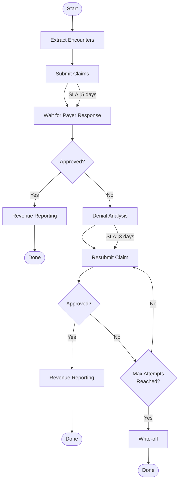
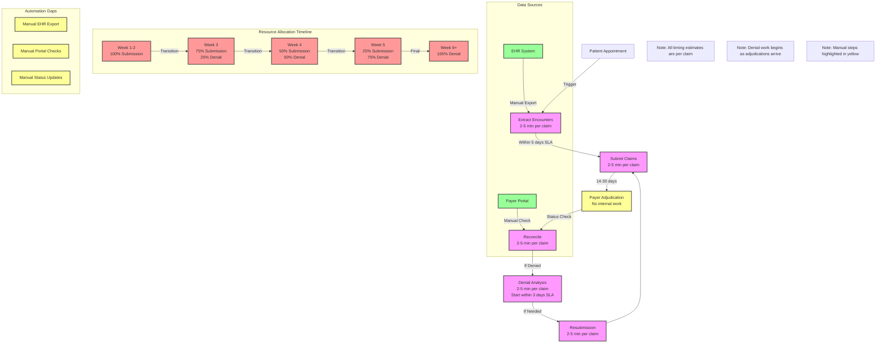

# Revenue Cycle Management (RCM) Workflow

## 🌊 RCM Workflow Steps

1. **Extract Encounters**
   - Pull appointment & clinical data from EHR
   - → This feeds into submission

2. **Submit Claims**
   - Send claim details to insurance portal
   - SLA: within 5 days of the doctor's appointment

3. **Wait for Payer Response**
   - Insurers typically take 14–30 days to respond
   - Claims can be:
     - ✅ Approved
     - ❌ Denied → goes to denial analysis

4. **Denial Analysis**
   - Review denial reason
   - Decide whether it's fixable

5. **Resubmission**
   - If fixable, correct and resubmit
   - SLA: handle denial within 3 days of payer response
   - Max resubmission attempts: usually 1–2

6. **Revenue Reporting**
   - Track approved $
   - Report to customer

## ⚙️ Parallel Work: Submission + Denial Work

- **Submissions are continuous:**
  - → every day, new claims come in

- **Denials come back with a lag (~2–4 weeks):**
  - → you need dedicated analysts or time allocation to process denials without slowing new submissions

**Simultaneous Requirements:**
- ✅ Keeping the 5-day submission SLA
- ✅ While meeting the 3-day denial SLA on older claims

This is why staffing/capacity planning is critical — you can't have all your analysts tied up doing just one side.

## 🔄 Process Flow

## 📊 Capacity Implications

1. **Daily New Claims**
   - Volume: 3,788 claims per day
   - Time needed: 66,288 minutes
   - SLA: Must complete within 5 days

2. **Daily Denial Work**
   - Volume: 379 claims per day
   - Time needed: 9,943 minutes
   - SLA: Must complete within 3 days

3. **Total Daily Capacity**
   - Available: 76,320 minutes (159 analysts)
   - Utilization: 99.9%
   - No buffer for:
     - Volume spikes
     - Time off
     - Training
     - Meetings
     - Quality review

## 🎯 Key Considerations

1. **Staffing Balance**
   - Need enough capacity for both new claims and denials
   - Can't sacrifice one SLA for the other

2. **Time Management**
   - Analysts must juggle both types of work
   - Need clear prioritization rules

3. **Risk Factors**
   - High utilization (99.9%) means no room for error
   - Any disruption could cause missed SLAs
   - Need to consider additional staffing or process improvements 

# RCM Workflow Documentation

## Process Steps and Timings

1. **Patient Appointment** (Trigger Event)
   - Initiates the RCM process
   - No internal work required

2. **Extract Encounters**
   - Time: 2-5 minutes per claim
   - Manual export from EHR system
   - Automation Gap: No automated extraction

3. **Submit Claims**
   - Time: 2-5 minutes per claim
   - SLA: Must be completed within 5 days
   - Manual submission process
   - Automation Gap: No automated submission

4. **Payer Adjudication**
   - Time: 14-30 days waiting period
   - No internal work required
   - External process

5. **Reconcile**
   - Time: 2-5 minutes per claim
   - Manual check in payer portal
   - Automation Gap: No automated status checking

6. **Denial Analysis** (if denied)
   - Time: 2-5 minutes per claim
   - SLA: Must be started within 3 days of payer response
   - Manual analysis process

7. **Resubmission** (if needed)
   - Time: 2-5 minutes per claim
   - Manual resubmission process
   - Returns to submission step

## Resource Allocation Timeline

### Weeks 1-2
- 100% of analysts on submission work
- No denial work yet (no adjudications)

### Week 3
- 75% submission work
- 25% denial work
- Initial adjudications begin arriving

### Week 4
- 50% submission work
- 50% denial work
- Increased denial volume

### Week 5
- 25% submission work
- 75% denial work
- Peak denial processing

### Week 6+
- 100% denial work
- Full denial processing capacity

## Automation Gaps

1. **EHR Integration**
   - Manual export required
   - No automated data extraction

2. **Payer Portal Integration**
   - Manual status checks
   - No automated reconciliation

3. **Status Updates**
   - Manual tracking required
   - No automated workflow management

## Key SLAs

1. **Submission SLA**
   - Must complete within 5 days
   - Includes extract and submit steps

2. **Denial Work SLA**
   - Must start within 3 days of payer response
   - Includes analysis and resubmission if needed 